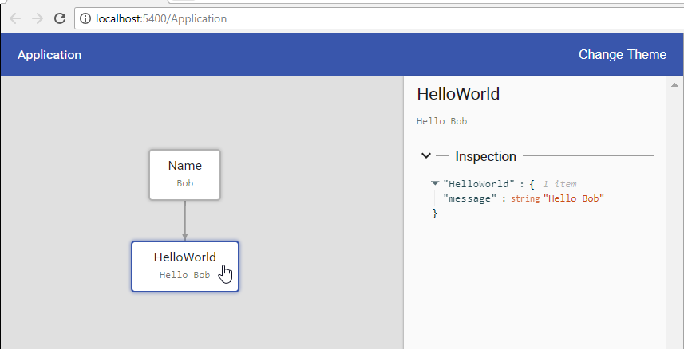

# DomainChoreograph

[](https://travis-ci.org/MaibornWolff/domainchoreograph)
[  ](https://bintray.com/domainchoreograph/domainchoreograph/core/_latestVersion)

*DomainChoreograph* is a kotlin library to describe, visualize and debug business algorithms in a declarative way. 

## Installation

1. Add the required dependencies and the repository (mavenCentral is work in progress)
```groovy
// build.gradle

repositories {
    maven {
        url = 'https://dl.bintray.com/domainchoreograph/domainchoreograph'
    }
}

dependencies {
    compile "de.maibornwolff.domainchoreograph:core:<latest-version>"
    kapt "de.maibornwolff.domainchoreograph:core:<latest-version>"
}
```

2. Make sure that you have the `kotlin-kapt` plugin activated.
This is necessary for the annotation processor. You can find more information 
[in the docs](https://kotlinlang.org/docs/reference/kapt.html).
```groovy
// build.gradle

apply plugin: "kotlin-kapt"

```


## Hello World
Let's write a *Hello World* program.

First we need to define the domain classes we want to use. In our case
this is just a `Name`. It is necessary to annotate the class with 
`@DomainDefinition`.

```kotlin
@DomainDefinition
data class Name (val value: String)
```

If we have a domain class that has a dependency to another domain class.
We add a static method with the dependencies as parameters. The method
needs to be annotated with `@DomainFunction` and all the dependencies
need to be annotated with `@DomainDefinition`.

```kotlin
import de.maibornwolff.domainchoreograph.core.api.DomainDefinition
import de.maibornwolff.domainchoreograph.core.api.DomainFunction

@DomainDefinition
data class HelloWorld(val message: String) {

    companion object {

        @DomainFunction
        fun resolveHelloWorld(name: Name): HelloWorld {
            return HelloWorld("Hello " + name.value)
        }
    }
}
```

Next we need to define out choreography. The choreography is an
interface which defines all the methods that the framework should generate
for you. The interface needs to be annotated with `@DomainChoreography`.

```kotlin
import de.maibornwolff.domainchoreograph.core.api.DomainChoreography

@DomainChoreography
interface HelloWorldChoreography {
    fun createHelloWorldWithName(name: Name): HelloWorld
}
```

Finally we can use our choreography implementation.

```kotlin
import de.maibornwolff.domainchoreograph.core.api.DomainEnvironment

fun main(args: Array<String>) {
    // Setup the environment. The environment can be used to configure the framework.
    val environment = DomainEnvironment()

    // We can use the environment to get our generated implementation
    val choreography = environment.get<HelloWorldChoreography>()

    // Which can be used like any normal java object
    val helloWorld = choreography.calculate(Name("Bob"))
    println(helloWorld.message) // Prints: Hello Bob
}
```

## Analytics Logger

A huge advantage of the framework is the possibility to visualize
the business logic. This is possible with *Logger* which have access
to some meta data of your program.

1. To visualize our example you first need to install the analytics tool.
```groovy
// build.gradle

dependencies {
    compile "de.maibornwolff.domainchoreograph:domain-analytics:<latest-version>"
}
```

2. In our main function, we now initialize the logger and start the ui server.


```kotlin
import de.maibornwolff.domainchoreograph.core.api.DomainEnvironment
import de.maibornwolff.domainchoreograph.domainanalytics.DomainAnalytics

fun main(args: Array<String>) {
    // First we initialize the analytics. Here you can pass some options, for example the ui port.
    val domainAnalytics = DomainAnalytics()
    // Next we start the ui server. This will open the browser with the user interface.
    domainAnalytics.server.start()

    // Finally we need to pass the logger to the environment
    val environment = DomainEnvironment(
        logger = setOf(domainAnalytics.logger)
    )

    // The following code has not changed
    val choreography = environment.get<HelloWorldChoreography>()

    val helloWorld = choreography.calculate(Name("Bob"))
    println(helloWorld.message)
}
```

3. If we start the program, we will see a visualization of our logic in the browser.



4. Now you now all the basics! Feel free to play around and try more complex examples.

## Some terminology

In order to explain the underlying concepts and to describe detailed usage of the library, let's agree on some terminology first.

### Domain Definition

*Domain Definitions* are the building blocks of the domain algorithm to be described. A domain definition is represented by a class annotated by `@DomainDefinition` and is called *domain definition type*.
It uniquely identifies a *domain object* in a given context. Furthermore, an algorithm can be provided (see `@DomainFunction`) that calculates the object based on other domain objects (again identified by domain definitions). 

### Domain Function

A *domain function* represents the algorithm of a *domain definition*. It's supposed to be _pure_ which means the method has no side effects and the result depends on method parameters only. The following constraints have to remain true:
* the method annotated by `@DomainFunction` needs to be defined in a companion object (think of it as some sort of factory method).
* there can only be one method in a class annotated by `@DomainFunction`.
* if a class has a method annotated by `@DomainFunction` the class itself needs to be annotated by `@DomainDefinition`.

If side effects are needed, for example to write or read something to/from a database, use *domain services* (see below).

#### Method Parameters of a Domain Function
The method parameters of a domain function are either *domain definition types* or *domain service types*.

By specifying parameters you can accidentally build cycles in the resulting dependency graph. That does not make any sense and is of course prohibited. The resulting dependency graph needs to be _acyclic_. 

#### Return Type of a Domain Function
A *domain function* return the *domain definition type* the domain function is defined in.

### Domain Definition Object
A *domain definition object* is an instance of a *domain definition type* and represents a value that is used as input or result of a choreography. 

### Domain Service
A *domain service* is similar to a *domain definition* but is not going to be serialized to during process visualization.

### Domain Service Object
A *domain service object* is an instance of a *domain service type* and represents a service that is used in domain functions. 

### Choreography

The result of defining an bunch of domain definitions is a directed acyclic graph (DAG) whereas *domain definition types* represent the set of nodes. Ingoing edges of each node are defined by parameters of the *domain function*. In order to actually calculate something we need to state what we want to calculate based on what. That statement we call *choreography* and is defined by an interface annotated by `@DomainChoreography`.

A corresponding implementation of that interface is _generated_ at compile time and can be obtained by a previously configured *domain environment* (see example above). It can also be stated as dependency in a domain definition. That way *sub choreographies* are made possible.

### Domain Environment

A *domain environment* is used to obtain generated implementations of a choreography. You can also configure a logging plugin.
  
## Other Information
* [License](./LICENSE)
